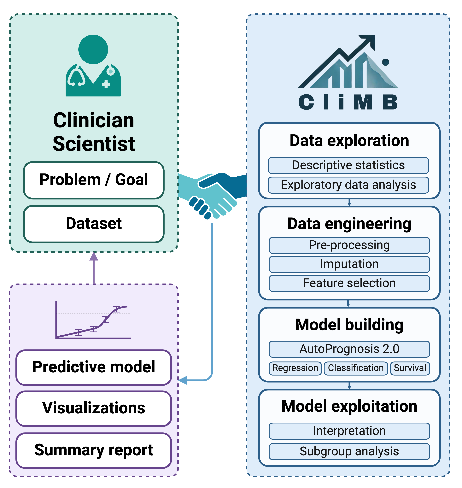

#  CliMB

> **CliMB**: **Cli**nical **M**achine learning **B**uilder

This repository is the implementation of the system as described in the preprint [CliMB: An AI-enabled Partner for Clinical Predictive Modeling](http://arxiv.org/abs/2410.03736).

[ Watch a usage demo]((https://www.youtube.com/watch?v=76XuR0K3F5Y))

## 🏥 Overview
CliMB is a no-code AI-enabled partner designed to empower clinician scientists to create predictive models using natural language. It guides you through the entire medical data science pipeline, in order to create predictive models from real-world data in just one conversation.

## 🔏 Data Privacy
TODO.

## 📦 Installation
TODO.

## 📚 Documentation
TODO.
