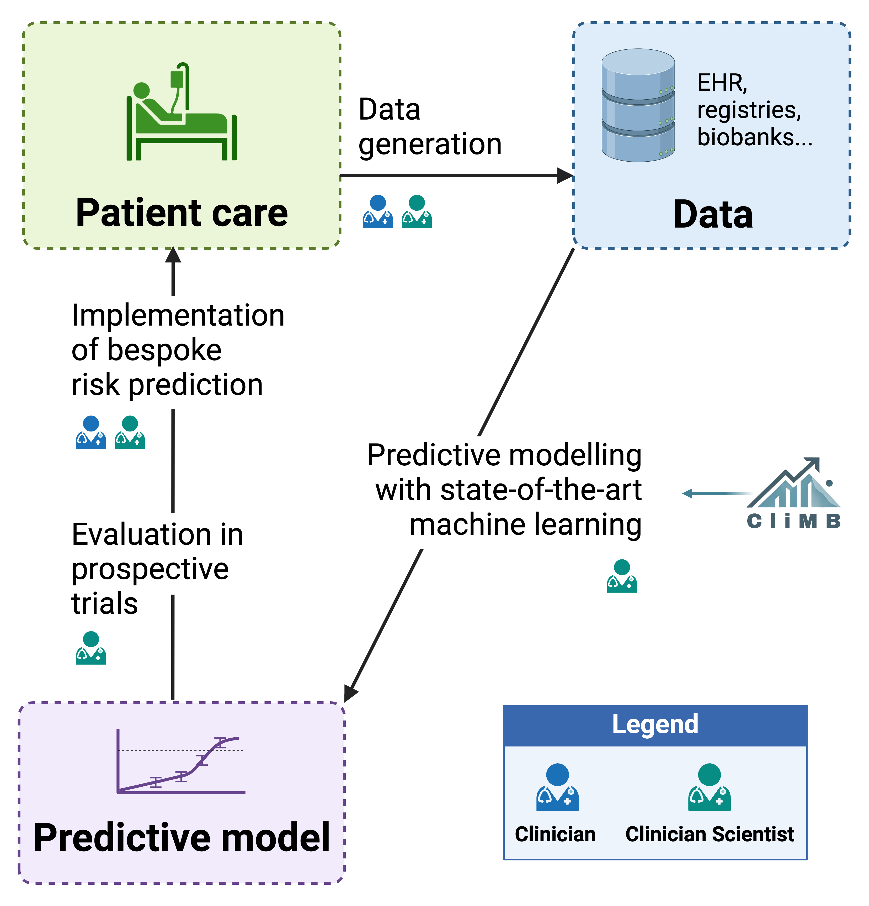

<!--  -->

#  CliMB

> **CliMB**: **Cli**nical **M**achine learning **B**uilder

This repository is the implementation of the system as described in the preprint [CliMB: An AI-enabled Partner for Clinical Predictive Modeling](http://arxiv.org/abs/2410.03736).

[ Watch the demo](https://www.youtube.com/watch?v=76XuR0K3F5Y)

## 🏥 Overview
CliMB is an AI-enabled partner designed to empower clinician scientists to create predictive models from real-world clinical data, all within a single conversation. With its no-code, natural language interface, CliMB guides you through the entire data science pipeline, from data exploration and engineering to model building and interpretation. The intuitive interface combines an interactive chat with a dashboard that displays project progress, data transformations, and visualizations, making it easy to follow along. Leveraging state-of-the-art methods in AutoML, data-centric AI, and interpretability tools, CliMB offers a streamlined solution for developing robust, clinically relevant predictive models.

 &nbsp;&nbsp;&nbsp;&nbsp;&nbsp;&nbsp;&nbsp;&nbsp;&nbsp;&nbsp;&nbsp;&nbsp;&nbsp;&nbsp;&nbsp;&nbsp;&nbsp; 

Our vision is for CliMB to integrate seamlessly into the clinician's workflow, supporting the complete cycle of clinical predictive modeling, and ultimately democratizing machine learning and AI utilization in healthcare.

## 🔏 Data Privacy
TODO.

## 📦 Installation
TODO.

## 📚 Documentation
TODO.
